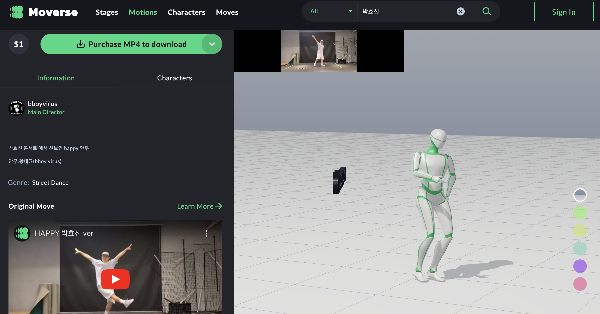

# 임시(홈페이지에 쓰일 Product 내용)

가상 아이돌 숫자에 비례하여 증가할 최소 5천명\~10만명의 집단 프로듀서들이 선착순으로 정족수만큼만 개별 액티비티 영상에 투표를 하게 되면 그 결과에 따라 해당 액티비티 영상은 승급이 되고, 해당 가상 아이돌은 가점이 누적되어 데뷔에 한발짝 다가가게 됩니다. -->&#x20;

 (1).png>)

가상 아이돌 회원은 , 신규로 입하된 쟝르별 음원과 안무를 자신의 아이돌에 적용할 수 있게 됩니다. -->

<figure><figcaption></figcaption></figure>

<figure><figcaption></figcaption></figure>

<-- 최대 9명의 가상 아이돌을 무대에 배치하여 아이돌별로 다른 안무 모션을 입힐 수 있으며, 배경을 꾸며 하나의  영상으로 다운로드하여 다른 소셜미디어에 공유할 수  있습니다.

안무의 창작자 인증 기반으로, 정밀한 모션 캡처를 지속적으로 생산해 낼수 있는 시스템이 마련되어 있습니다. -->&#x20;

음원과 안무를 이 세상에서 가장 많이  생산해 낼 수 있는 시스템을 프로토타이핑 했습니다. -->&#x20;

 (2).png>)

&#x20;<-- 비트 음원 영상에 자신의 비트 영상을 걸어 대결을 펼칠수 있습니다. 또한, 남의 비트 음원 영상에 자신의 안무 영상을 올리면, 영상 합성이 자동으로 됩니다.

 (1).png>)

<-- 하나의 영상에 여러 대결이 리스트업 되며, 각 도전영상에 대해 또 다시 여러 도전영상들이 올라올수 있게 되어 있어, 다단계 대결 네트웍이 형성이 됩니다.

<figure><figcaption></figcaption></figure>

<-- 하나의 음원 영상에 자신의 목소리 영상을 자동으로 합성하여 올릴수 있으며, 또 다른 사람은 드럼 소리 영상을 추가하고, 또 다른 사람은 안무 영상을 합성해 갈 수 있습니다.    <-- 안무의 경우, 여러 사람이 하나의 루틴이 되도록 원격으로 공연 작품을 완성해 갈수 있으며, 이 역시 다단계 네트웍 구조로 무한 확장 방식으로 무수한 생산이 가능해집니다..
