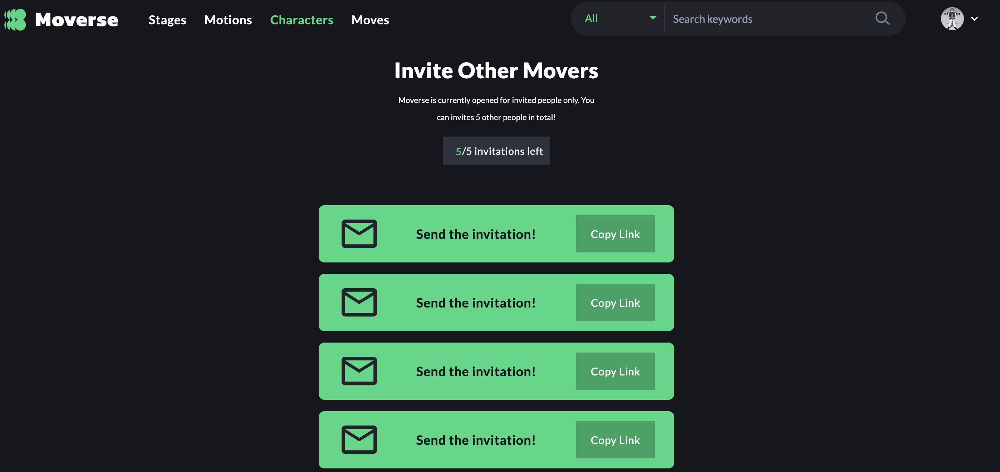
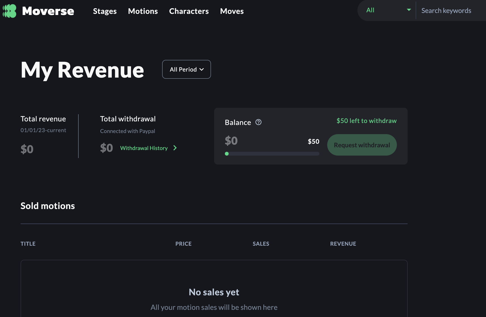

# Technology

<figure><figcaption>
仮想人物制作技術 DeepReal™紹介
</figcaption></figure>

## **DEEP REAL**™ **AI**

### 本物よりも本物のような仮想人物制作

ディープリアルAIは、生成的な人工知能を基盤とし、バーチャルヒューマンコンテンツを簡単かつ迅速に自動制作して提供します。一般人の老若男女だけでなく、KPOPアイドルなど世界中のスターの顔を分析し、ペルソナに合ったバーチャルヒューマン顔を製作する事が可能です。

まるで実在する人のようにリアルな人物表現が出き、2023年からは顔だけでなくヘアスタイル、衣装、メイク、ポーズまでも実際のように表現する研究が進められています。

### 1) リアルタイムフェイススワッピング技術&#x20;

オンラインストリーミングなど各種生放送状況で活用可能なリアルタイムフェイススワップ技術で、バーチャルヒューマンの活用性をリアルタイムで相互作用の領域にまで拡張することも可能になります。人種、老若男女区別なくリアルな顔を生成し、映像の中の顔の視線処理、筋肉などを学習し、仮想人物の動きを実際のように細かくコントロールします。

メタバス、AI、ブロックチェーンなどのコミュニケーションインフラとデジタル環境が5Gの浮上とともに進化し続け、ディープリアル技術を通じてファンとリアルタイムでコミュニケーションする事を可能としています。

### 2) 人間の役者なしで可能な全身顔の筋肉と唇の動き技術

ChatGPT、TTS（text to speech）、Speech to Face（Face prediction from speech signals）技術により、仮想アイドルをガイドする実際の役者がなくてもコンテンツ制作が可能です。様々なコンテンツを継続的に提供しなければならないエンターテイメント事務所の負担を減らしてくれる画期的な技術で、制作現場にさらに安定的で魅力的な機会を創出致します。

## ディープリアル技術とイタニティ

<figure><figcaption>
ディープリアルAI技術で誕生した世界初の仮想K-POPガールズグループイタニティ 
</figcaption></figure>

\
「Eternity」はディープリアルAI技術で作られた仮想プロジェクトガールズグループです。 「AIドキドキチャレンジ」とも呼ばれながら、SNSで話題を集めた仮想人物の男女それぞれ101人のうち、理想のタイプを選ぶテストを経て、最終的に選ばれた11人で構成されました。イタニティはAIが選んだ韓国アイドル歴史の20年間の人物のイメージを学習して作った101人の仮想人物のうち、最終的に選ばれた11人で、優れたルックスはもちろん世界観も形成している魅力的な仮想プロジェクトガールズグループです。

'이터니티'는 딥리얼AI는 전 세계적으로 새롭게 떠오르는 버추얼 셀리브리티, 인플루언서 등으로 활동하는 버츄얼 휴먼을 움직임의 제약, 긴 제작 기간, 높은 운용 비용 등 기존의 한계점을 벗어나 보다 합리적인 비용으로 만날 수 있습니다.

現在まで「アイムリアル（I'm real）」、「ノフィルタ」（No filter）、「パラダイス（Paradise）」、「DTDTGMGN」などの音源、MVを披露し、ロンチング以来、国内外300件以上のメディアに露出されるなど、多様な活動 をしています。 「イタニティ」はディープリアルAIとして、全世界的に新たに浮上すしているバーチャルセリブリティ、インフルエンサーなどで活動するバーチャルヒューマンを動きの制限、長い製作期間、高い運用コストなどの既存の限界なしでより、合理的なコストで会えます。

<figure><figcaption>
イタニティ4番目のシングルアルバム「DTDT GMGN」MV中（2022） 
</figcaption></figure>

### イタニティフィルモグラフィー

<figure><figcaption></figcaption></figure>

*   ·国内AIエンターテイナーの中で唯一グローバルファンダム保有。  \*ファンダム名「イタナル」

    &#x20;·21年3月発売後、22年までに4枚目のデジタルシングルアルバム発売、間近の2023年上半期初の正規アルバム発売予定

    · イギリス＜V\&A＞王立博物館の「韓流WAVE」展示会で、BTS、black pinkと共に展示中（～2023年6月）

    &#x20;·イギリスBBC特別ドキュメンタリー「100 Women 2022、NEXT KPOP PRINCESS」特集放送など300件以上の報道

    · SCMP、AFN、SBS、EBS、YTN、アリランTV、KBSなどバラエティーからニュースまで、2022年国内外多数放送出演&#x20;

### プロフェッショナルK-Pop振り付けモーションが100%投影される動くアバター

### 振り付けとオリジナル創作者間のマッチング認証でより、創作者ロイヤルティ収入基盤を確保

映像洪水の時代の中、ダンサーたちが音楽のマーケティングに及ぼす影響力に比べて、原作振り付け著作権の持ち主としての収入が無かったことから比べると、ダンサーたちの長年の念願だった創作振り付けへの経済圏駆使を実現できるようになる。

&#x20;1.振り付け登録のためには、ダンサーがダンサーを招待しなければならない仕組みを取り、信頼性を確保&#x20;

&#x20;2.振り付けモーションスクショ（当社が遠隔で進行または創作者が直接進行）

&#x20; 3\. 流通及び売上シェア

<figure><figcaption></figcaption></figure>

 

<figure><figcaption></figcaption></figure>

 

<figure><figcaption></figcaption></figure>

## VS. 집단 쌍<mark style="color:red;">(상)</mark>대 비교에 의한  안무/작곡/목소리/작사 영상 생산 특허 및 시제품 개발 실적&#x20;

## VS。 集団相対比較による振り付け/作曲/声/作詞、映像生産特許および試製品開発実績

### 映像間対決を32強からトーナメントで進行可能であり、特定基準映像に無数の合成が可能な技術で最高の産物が生産できるシステム

가상 아이돌 하나를 놓고서, 대회를 열어 음원이나 작곡 대결을 토너먼트로 진행이 가능함. 여기서 선정된 곡 하나를 두고서, 무수한 작사 대결을 벌일수 있으며, 최종 선정된 음원(가사가 흘러가는 음원)을 두고 최종적으로 목소리 대결을 벌일수 있<mark style="color:red;">슴</mark>.  (무한 다단계 네트웍 생산 시스템)

仮想アイドルを一つを置いて、大会を開催し音源や作曲対決をトーナメントで進行する事が可能。 ここで選ばれた曲一つを置いて、無数の作詞対決を行うことができ、最終的に選ばれた音源（歌詞が流れる音源）を置いて最終的に声対決を繰り広げることも可能である。 (無限多段階ネットワーク生産システム)

 (2).png>)  (1).png>)
