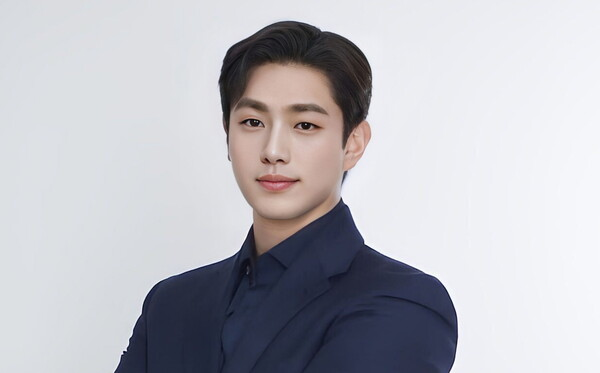
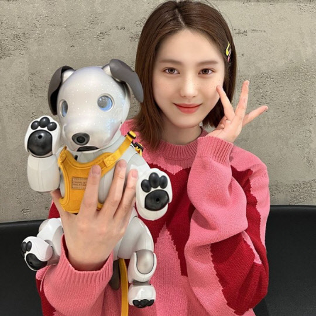

# Team

* 우리는 세계 최초의 AI Girl Group, Eternity, Boy Idol Benjamin, Gen Z 의 아이콘 YT 를 창출한 바 있습니다. 또한, 우리는 라이프스타일과 미디어 부문에서도 다양한 파트너쉽을 맺고 있습니다. 신세계 백화점, 아리랑 국제방송, 로레알 등이 그것입니다.&#x20;
* 우리는 아름다운 외모를 지닌, 5백만명의 AI-Dol 군단을 생산할 준비를 마쳤습니다. 사용자의 얼굴 사진을 기반으로 하여 생성할 수도 있습니다.


ETERN!TY


<figure><figcaption>
Benjamin
</figcaption></figure>

<figure><figcaption>
YT
</figcaption></figure>

벤자민과 YT의 행보들을 뉴스 기사에서 만나 보세요.







* &#x20;코로나19 기간 동안, 우리 팀은 자체 제작한 beatflo 앱으로 온라인 댄스 대회를 10회 개최했습니다. 비보이 대회에는 일본의 천재 비보이 Tsukki, 한국의 Jinjo Crew, 대만의 Choco 등 30개국의 국가대표 선수들이 참가했습니다. 밸리댄스의 경우 7개국이 참가해 1만8000표가 투표되었습니다. 폴 댄스의 경우 일본 여성이 한국 최고의 미녀들과 대결하였고, 일본이 우승했습니다. 
&#x20;



* 또한 우리 팀은 moverse.club을 통해 K-pop 명곡의 Signature 안무 모션 캡처를 제작하여 Metaverse(Sandbox에서 댄스 모션을 담당하는 kinetix, 한국 대표 메인넷 시그마체인 Metaverse PikiRoom, 이스라엘의 avaturn 아바타 , 메타버스 케이팝 관 개발사 https:// www.gamestate.one/ 등) 에 공급해 오고 있습니다. 



<figure><figcaption></figcaption></figure>





