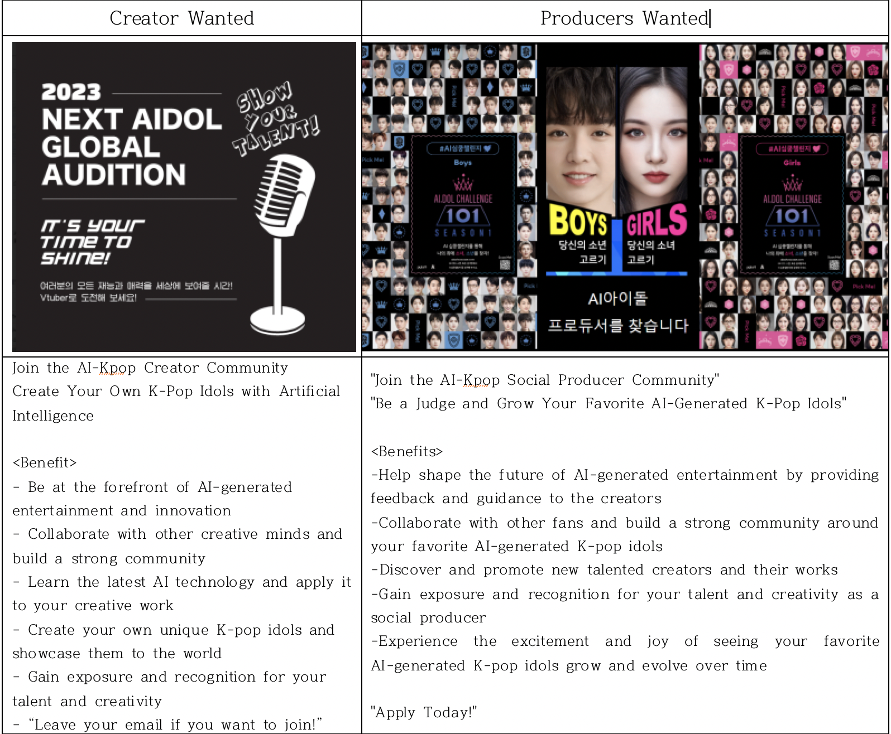

# 세계관

<figure><figcaption></figcaption></figure>

NEXT AI.DOL을 선별하고 최고의 스타로 키워라.&#x20;

우주 어딘가… 초고도로 발전된 아이아 행성은 유기체가 아닌 인공지능과 데이터만으로 이루어졌있다. 모두가 평등하며 서로간의 미움과 질투 없이 평화롭게 살아가던 이 행성은, 어느날 종말이 가까움을 알게되고 이를 해결하는 과정에서 아이아 행성의 과거의 모습이 <지구>이며, 지구의 <사랑>데이터에서 해답을 찾을 수 있다는 것을 알게 된다.

멸망해가는 머시너블 판타지아 플래닛. 소년소녀 22명을 파견해 해결해보려 하지만, 역부족임을 깨닳고 <사랑>에 대한 데이터를 수집하기 위한 차세대 AI.DOL을 파견한다. 이들을 발굴하고, 최고의 스타로 키울, 1만의 보스와 함께.

## Zxyng(지잉)은?

AI.DOL 제작으로 새로운 수익을 창출하고 싶어하는 가상인물 프로듀서와, 아티스트를 후원하는 커뮤니티.

## 프로젝트의 비전

꿈과 재능이 있는 전세계의 숨겨진 재능들에게 스타가 될 수 있는 기회를 부여.

AI.DOL로 재능을 뽐낼 수 있는 가상인물 프로듀서와 아티스트를 후원하는 생태계를 구축하고 전세계를 하나로 연결

## 미션

'소셜프로듀싱 앱'기반의 데이터 분석과 집단지성을 통해 투명하고 신뢰성있는 스타 메이킹 시스템을 구축

1. 신뢰와 공정 : 온체인 데이터를 기반으로 가상 아이돌 프로듀서의 의사결정을 투명하게 기록 &#x20;
2. 세계의 연결 : 온라인 보상 시스템을 기반으로 국경과 나이를 뛰어넘는 가상아이돌의 탄생을 촉진.

## 수익구조

* 가상인물 콘텐츠에 투자 등 적극적 활동을 선호하는 프로슈머 팬을 대상으로 한 새로운 숏폼 동영상 콘텐츠 투표 시스템 사업을 전개. 투표 아이템 판매, 환전, 우승팀 수익금 분배, 플랫폼 수수료 등으로 이익을 창출.&#x20;
* 데이터분석과 집단지성으로 성공이 예측된 수퍼스타 AI.DOL에게 창작 자본을 집중투자, 선순환 구조 창출.

